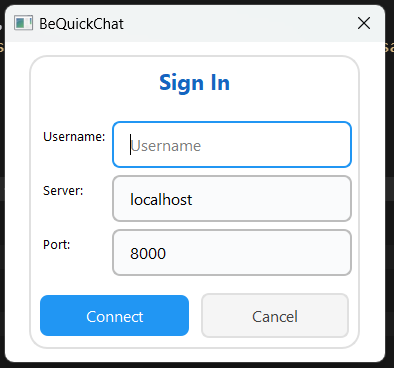
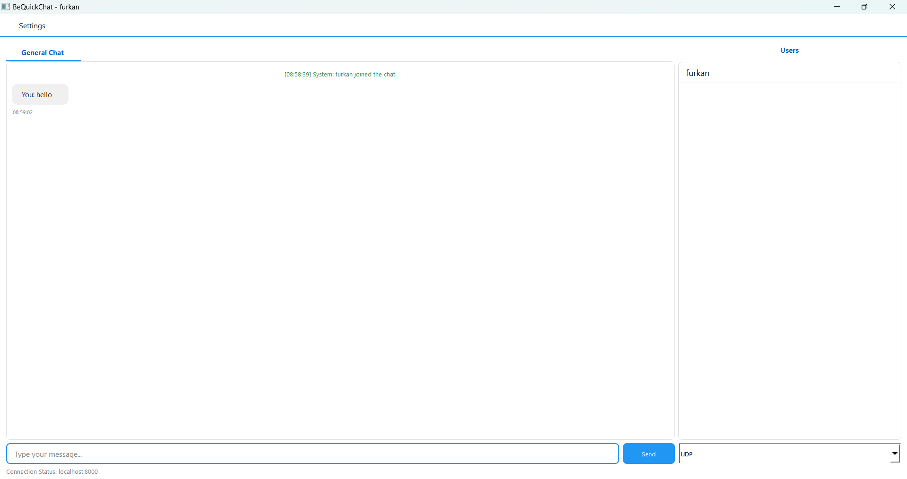
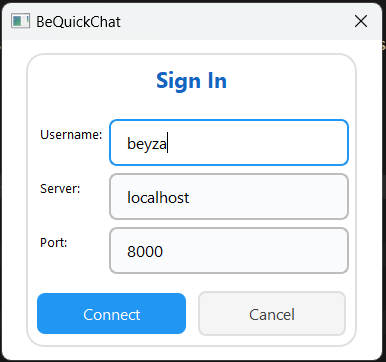
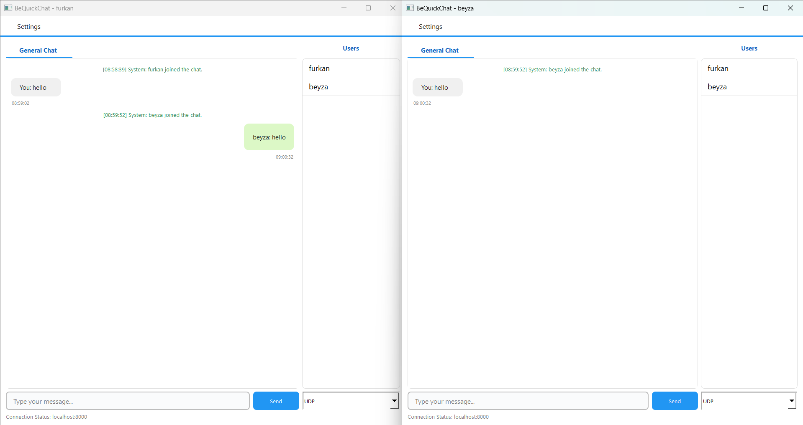
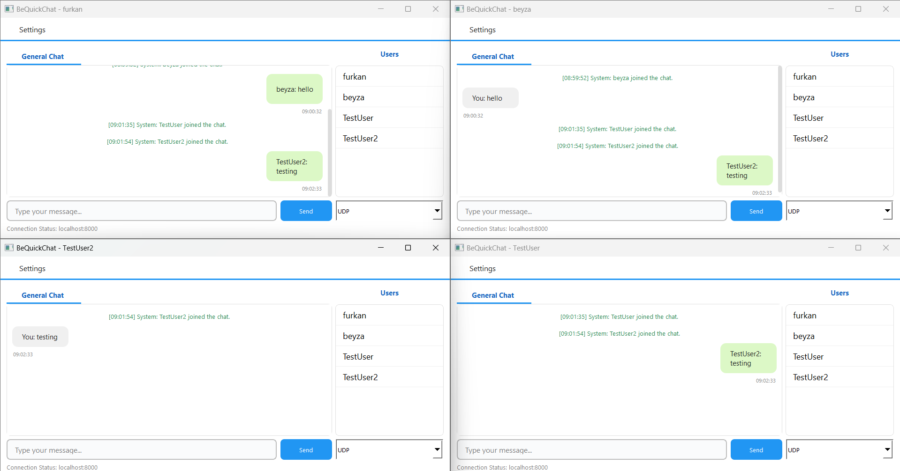
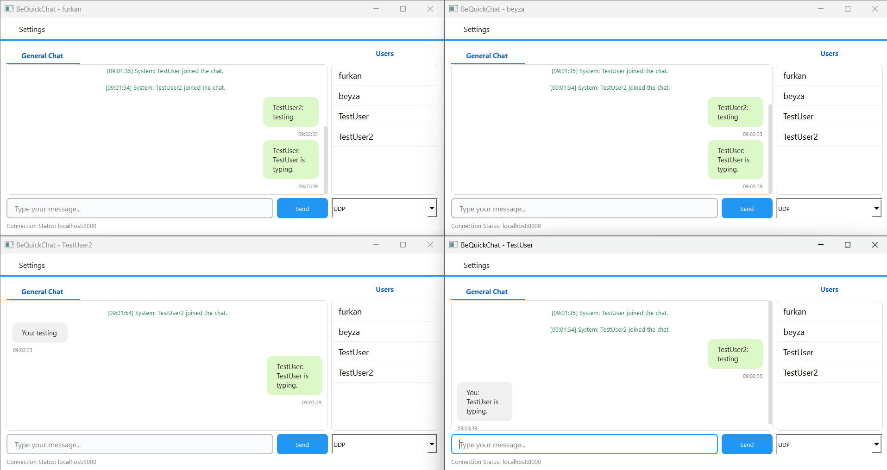
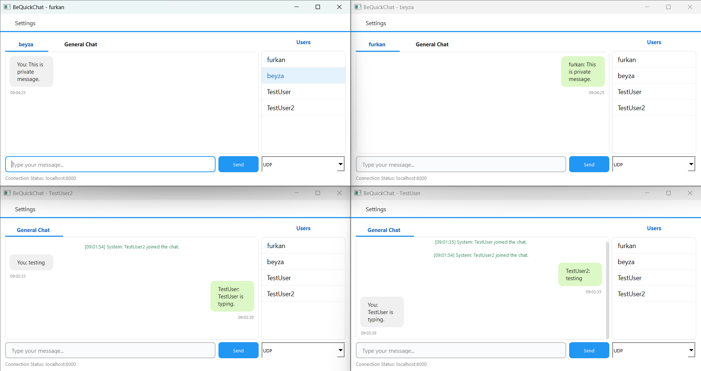

# BeQuickChat User Manual

---

## 1. Introduction

BeQuickChat is a modern, multi-user chat application with a custom UDP protocol and a stylish PyQt5 interface. This manual explains how to install, run, and use the application step by step.

---

## 2. Installation

### Requirements
- Python 3.8 or higher
- PyQt5 >= 5.15.0
- matplotlib >= 3.5.0 (for performance tests)

### Installation Steps
1. Go to the project folder:
   ```bash
   cd network
   ```
2. Install the required packages:
   ```bash
   pip install -r requirements.txt
   ```

---

## 3. Starting the Server

1. In a terminal or command prompt, run:
   ```bash
   python src/server.py
   ```
2. You should see a message like:
   ```
   [SERVER] UDP listening: 0.0.0.0:8000
   ```

---

## 4. Starting the Client

1. Open a new terminal window.
2. Run:
   ```bash
   python src/client.py
   ```
3. In the login window:
   - Enter your username.
   - Enter the server address and port (default: 127.0.0.1 and 8000).
   - Click the "Connect" button.

---

## 5. General Chat Usage

- Type your message and click "Send" or press Enter.
- Your messages appear in a chat bubble on the left (gray), others' messages on the right (green).
- System messages (join/leave) appear at the top.
- The user list is always visible on the right.

---

## 6. Private Messaging

- Double-click a user in the user list to open a private chat tab.
- Private messages also appear as chat bubbles (your messages left, theirs right).

---

## 7. Leaving the Application

- When you close the window, a leave notification is sent to the server.
- Other users will see a system message that you left the chat.

---

## 8. Customization

- **App Icon:** Replace `assets/bequickchat.png` with your own PNG icon.
- **Tab Close Icon:** Replace `assets/close.png` for the tab close button.
- **Chat Bubble Style:** Edit the `ChatBubble` class in `src/client.py` to change colors or sizes.

---

## 9. Troubleshooting

- **Cannot connect to server:** Make sure the server is running and the IP/port is correct.
- **Messages not sent/received:** Check your network connection and server status.
- **ConnectionResetError:** This may occur if the server is closed or there are network issues.
- **GUI does not open:** Ensure PyQt5 is installed and your Python version is compatible.
- **Icons not visible:** Make sure `assets/bequickchat.png` and `assets/close.png` exist and are valid PNG files.

---

## 10. Keyboard Shortcuts

- **Enter:** Send message
- **Double-click (user list):** Open private chat tab

---

## 11. Screenshots

Aşağıda uygulamanın farklı bölümlerine ait ekran görüntüleri yer almaktadır:

### Giriş Sayfası



### Ana Sayfa



### Giriş Sayfası



### Genel Sohbet



### Genel Sohbet



### Genel Sohbet



### Özel Mesaj


---

## 12. Contact

For any issues or suggestions, please contact the project maintainer.

---

## 13. Security Notice

All chat messages are encrypted with AES before being sent over the network. However, there is currently no user authentication (login/password). For additional security, avoid sharing sensitive information. 